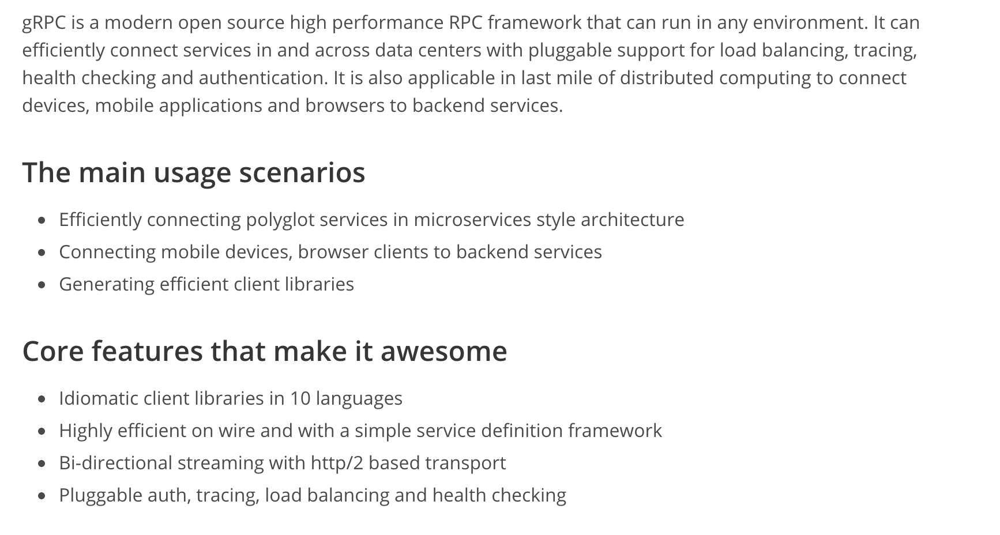

## gRPC and Protocol Buffers Sample

Sample to demonstrate gRPC and Protocal Buffers. gRPC/Protobuf are completely language agnostic. We can have a server built in one language and 
a client built in another language altogether.

## Useful Documentation

[gRPC](https://grpc.io)

[ProtoBuf](https://developers.google.com/protocol-buffers)

## Getting Started

Install [ProtoBuf Compiler](https://github.com/protocolbuffers/protobuf/releases)

    Use a Version Manager like gvm or goenv. I prefer using gvm as it has an option of isolating the package dependencies of one Project from another
    using pkgsets. 

        go get -u google.golang.org/grpc

        go get -u github.com/golang/protobuf/protoc-gen-go

 ## Generating client code from proto file

        protoc --proto_path=proto --proto_path=thirdparty --go_out=plugins=grpc:proto proto/service.proto

## Advantages of ProtoBuf over JSON 

    - Size of Payload is less
    - Parsing JSON is quite CPU intensive since JSON is text based while Protobuf is binary

## Reference

[gRPC Tutorial](https://www.youtube.com/watch?v=Y92WWaZJl24)